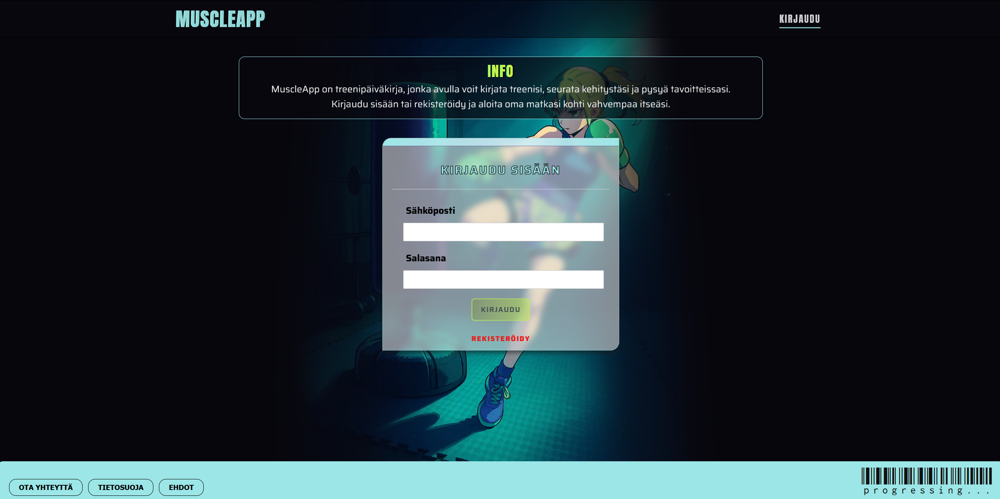
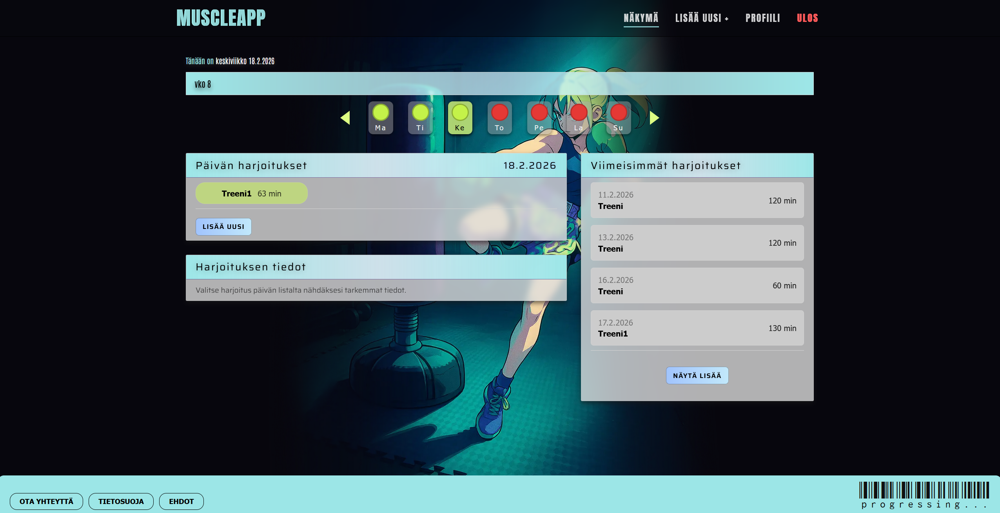
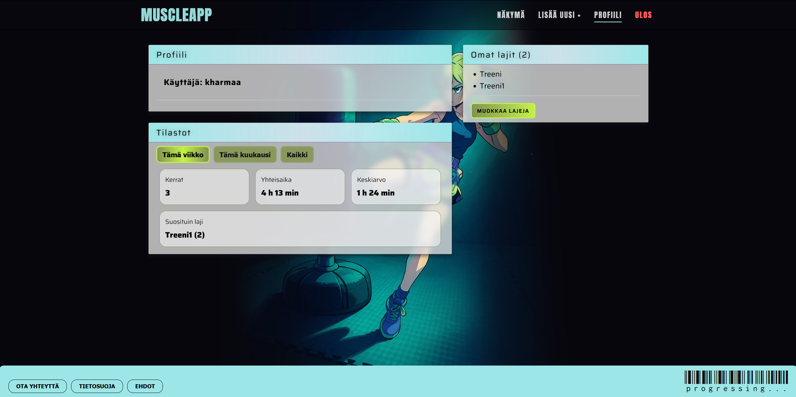
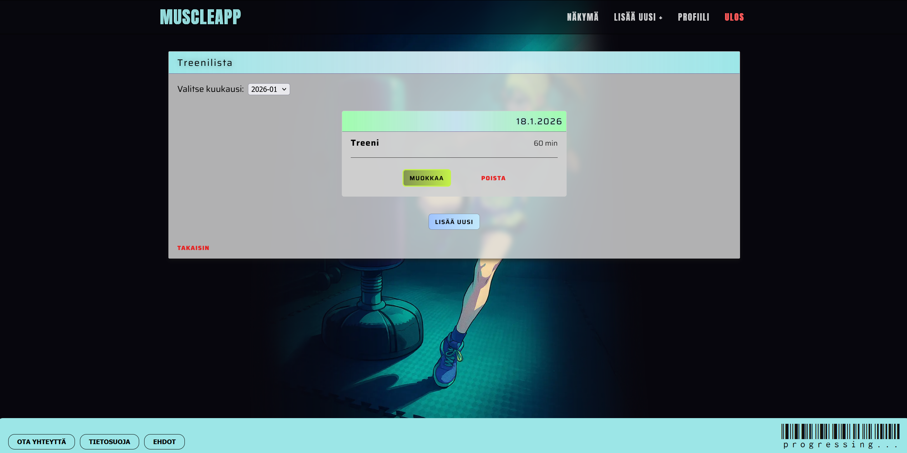

# MuscleApp – MERN-treenipäiväkirja

MuscleApp on full stack -tason **MERN**-sovellus, jonka avulla rekisteröitynyt käyttäjä voi voi kirjata treenejä, hallita omia harjoituslajejaan sekä tarkastella henkilökohtaisia tilastoja.  
Sovellus on toteutettu modernilla arkkitehtuurilla ja julkaistu tuotantoon käyttäen **Verceliä** ja **Renderiä**.

- **Live demo (frontend):** https://mernapp-umber.vercel.app
- **Backend API:** https://mernapp-backend-tbx6.onrender.com

---

## Mitä projekti demonstroi

- Full-stack MERN -kehitystä
- Full stack -projektin läpivienti ideasta tuotantoon
- Turvallinen autentikointi ja valtuutus (JWT)
- Frontend–backend-erottelu
- REST-rajapintasuunnittelu
- Tuotantoon vienti ja debuggaus
- Ongelmien ratkaisu (CORS, ympäristömuuttujat, deploy-haasteet)

---

## Ominaisuudet

### Autentikointi ja käyttöoikeudet

- JWT-pohjainen kirjautuminen
- Suojatut API-endpointit
- Automaattinen uloskirjautuminen tokenin vanhentuessa

### Treenien hallinta

- Treenien luonti, muokkaus ja poisto
- Treenit ovat käyttäjäkohtaisia

### Kalenteripohjainen käyttöliittymä

- Päiväkohtainen treeninäkymä
- Viikkonäkymä

### Lajien hallinta

- Käyttäjä voi luoda omia harjoituslajeja
- Lajeja voi muokata ja poistaa
- Laji ei ole poistettavissa, jos sitä käytetään treeneissä

### Profiili ja tilastot

- Viikkotilastot
- Kuukausitilastot
- Kaikki treenit yhteensä
- Treenien lukumäärä ja kokonaiskesto

### Tuotantoympäristö

- Frontend: Vercel
- Backend: Render
- Tietokanta: MongoDB Atlas

---

## Screenshotit

### Kirjautuminen



### Dashboard



### Treenin tiedot



### Profiili & tilastot



---

## Teknologiat

### Frontend

- React (Vite)
- React Router
- Custom Hooks
- Context API
- CSS Modules

### Backend

- Node.js
- Express
- MongoDB + Mongoose
- JWT Authentication
- express-validator
- REST API -arkkitehtuuri

### DevOps / Tooling

- Vercel
- Render
- MongoDB Atlas
- Git & GitHub
- Environment variables (.env)

---

## Projektin rakenne

```txt
mernapp/
├── client/              # React frontend (Vite)
│   ├── src/
│   └── dist/
├── server/              # Node / Express backend
│   ├── controllers/
│   ├── middleware/
│   ├── models/
│   ├── routes/
│   └── app.js
└── README.md
```

---

## Ympäristömuuttujat

### Backend(server)

- MONGODB_URI=your_mongodb_uri
- JWT_SECRET=your_jwt_secret
- NODE_ENV=production

### Frontend(client)

VITE_BACKEND_URL=https://mernapp-backend-tbx6.onrender.com

---

## Local Development

#### Clone repository

- git clone https://github.com/Kharmaa/mernapp.git
- cd mernapp

#### Backend

- cd server
- npm install
- npm run dev

#### Frontend

- cd client
- npm install
- npm run dev

- Frontend: http://localhost:5173
- Backend: http://localhost:5000

---

## Api Endpoints

Alla on listattuna sovelluksen keskeiset REST-rajapinnat.

#### Auth

- POST /api/user/signup
- POST /api/user/login
- GET /api/user/me

#### Workouts

- GET /api/workouts
- GET /api/workouts/:wid
- GET /api/workouts/user/:uid
- POST /api/workouts
- PATCH /api/workouts/:wid
- DELETE /api/workouts/:wid

#### Workout Types

- GET /api/types
- POST /api/types
- PATCH /api/types/:tid
- DELETE /api/types/:tid

---

## Ota yhteyttä

- Projekti on toteutettu oppimistarkoituksiin

- Jos haluat kysyä projektista tai antaa palautetta, voit olla yhteydessä GitHubin kautta.
